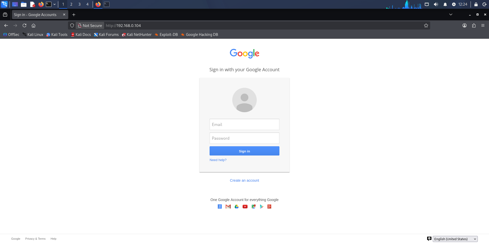
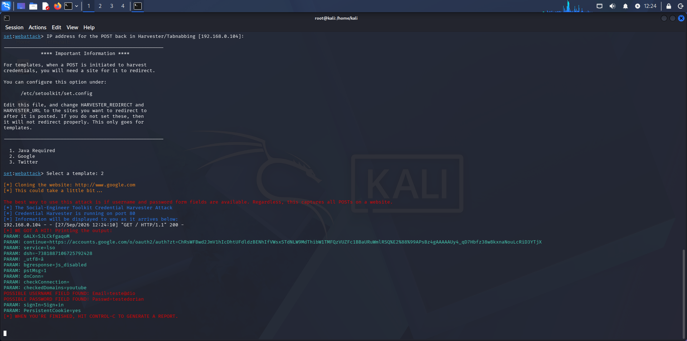
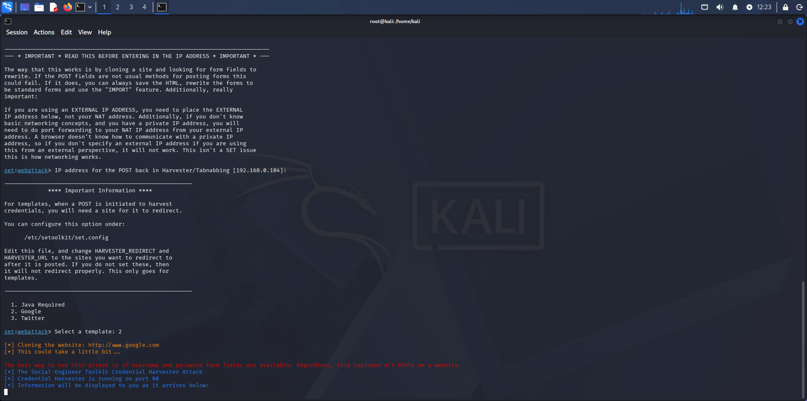

# Phishing — Simulação em Ambiente Controlado

### Ferramentas
- Kali Linux
- setoolkit

### Configurando a Simulação no Kali Linux
- Acesso root: `sudo su`
- Iniciando o setoolkit: `setoolkit`
- Tipo de ataque: `Social-Engineering Attacks`
- Vetor de ataque: `Web Site Attack Vectors`
- Método de ataque: `Credential Harvester Attack Method`
- Método de ataque: `Web Templates`
  *(Utilizei Web Templates pois a maioria dos sites que tentei clonar possuíam mecanismos de proteção/bloqueio, portanto foi me recomendado o Google)*
- Endereço de teste: `192.168.0.104`
- Modelo utilizado: Página de login de demonstração

### Resultados
- Página simulada acessada via `http://192.168.0.104`
- Formulário preenchido com dados fictícios
- Credenciais capturadas em tempo real no terminal
- Todos os testes realizados em ambiente isolado, sem exposição a terceiros

### Evidências
- **Página de login simulada**
  

- **Credenciais capturadas**
  

- **Terminal — Execução Completa**
  

### Sinais de Alerta Identificados
- Endereço `192.168.0.104` diferente do domínio oficial
- Sem certificado HTTPS válido
- Formulário envia dados para servidor local

### Medidas de Proteção
- Sempre digitar o endereço oficial diretamente no navegador
- Verificar o domínio e o cadeado de segurança antes de inserir dados
- Ativar Autenticação em Duas Etapas (2FA) em todas as contas
- Nunca inserir credenciais acessando por links de mensagens

### Aviso Ético
Todo o projeto foi realizado com fins **exclusivamente educacionais**, em ambiente controlado e com dados fictícios. O conhecimento em segurança cibernética serve para **proteger**, não para atacar.
